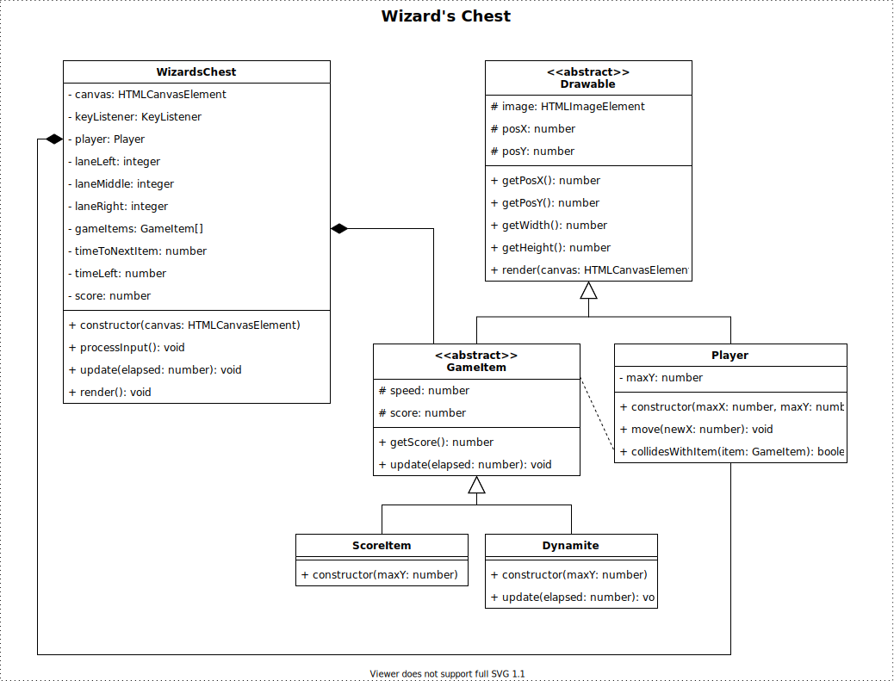

# Examen Object Oriented Programming (OOP) - Herkansing

| Vak | Object Oriented Programming |
|---|---|
| Code | CU75004V1 |
| Datum | 26 januari 2022 |
| Tijd | 09:00 |
| Tijdsduur | 180 minuten (+extra) |
| Inleveren | Inleveren via CodeGrade |

### Instructies
 - Lees de vereisten voor het spel vanaf pagina 2.
 - Download de starter .ZIP uit Learn.
 - Unzip en open de directory in je persoonlijke code editor, bijvoorbeeld Visual Studio Code.
 - Run `npm install`.
 - Implementeer de basisvereisten.
 - Run `npm run build` om de game te compileren. (Je kunt ook "watch mode" gebruiken met `npm run watch`).
 - Zodra je de basisvereisten hebt voltooid, kunt je de geavanceerde vereisten implementeren.

### Toegestaan
 - Gebruik van je eigen laptop 
 - Gebruik van boeken en/of eigen notities
 - Gebruik van internet als informatiebron of ter referentie

### NIET Toegestaan
 - Gebruik van internet als communicatiemiddel (e-mail, Teams, Discord, posts op Stack Overflow, enzovoort)
 - Gebruik van andere communicatiemiddelen zoals bijvoorbeeld een mobiele telefoon
 - Gebruik van oortjes en hoofdtelefoon

### Inleveren
 - Inleveren op de bijbehorende CodeGrade.
 - Lever ENKEL je *.ts bestanden in
 - Het is toegestaaan om tijdens het examen meerdere keren in te leveren. Na elke inlevering is er een wachttijd van 10 minuten voordat je opnieuw kan inleveren. Het is toegestaan om in te leveren totdat het examen voorbij is.
 - CodeGrade test enkel: 1) dat jouw code succesvol compileert en 2) de output van ESLint. De rest van het examen wordt handmatig nagekeken.
 - De laatste inlevering wordt beschouwd als je uiteindelijke inlevering en zal beoordeeld worden.
 - De beoordelingscriteria staan op pagina 4.

# De Tovenaarskist
> De tovenaar Mordak vergat zijn magische kist op slot te doen en alle edelstenen vielen eruit. Het is aan jou om ze terug te halen en te voorkomen dat de kwaadaardige Calvaria ze te pakken krijgt.

Met behulp van je toetsenbord bestuur je een magische kist. Terwijl je edelstenen vangt, moet je de schedels en het dynamiet vermijden.

## Voorbeeld demo

Je kunt een demo van game spelen [hier spelen](https://hz-hbo-ict.github.io/ts-wizards-chest/).

## Basisvereisten
 - Het klassediagram is gegeven als uitgangspunt. Gebruik overerving (inheritance) en polymorfisme op een correcte manier.

 - De aangeleverde bestanden `GameLoop.ts`, `CanvasUtil.ts` en `KeyListener.ts` mogen niet gewijzigd worden.

 - De speler is een kist () aan de bovenkant van het scherm en kan in de linker-, midden- of rechterbaan bewegen. Je kunt de kist besturen met het toetsenbord.

 - Tussen de 300ms tot 600ms (milliseconden) verschijnt er telkens een nieuwe edelsteen, schedel, óf een stuk dynamiet onderaan het scherm, in een willekeurige baan. Een edelsteen heeft 80% kans om te verschijnen en een schedel heeft 20% kans om te verschijnen.

- Er zijn 3 soorten edelstenen. Elke edelsteen geeft de speler een ander aantal punten, en heeft een kans om te verschijnen:
    1. Rode Edelsteen : 100 punten, 20% kans om te verschijnen
    2. Groene Edelsteen : 50 punten, 20% kans om te verschijnen
    3. Blauwe Edelsteen : 5 punten, 60% kans om te verschijnen

 - Er zijn 3 schedels, die elk een bepaald aantal minpunten opleveren:
    1. Rode Schedel : -100 punten, 20% kans om te verschijnen
    2. Groene Schedel : -50 punten, 20% kans om te verschijnen
    3. Blauwe Schedel : -5 punten, 60% kans om te verschijnen

 - Edelstenen en Schedels bewegen van onder naar boven in één van de drie banen met een snelheid van 0.2px per verstreken ms.

 - **Kaboem!** Er is een kans van 20% dat een staaf dynamiet () verschijnt. Als het dynamiet de kist raakt, verliest de speler alle punten (punten teruggezet naar 0).

 - De snelheid van het dynamiet is 0.1px per verstreken ms, en neemt elk frame met 0.005% toe.

 - Er wordt gezegd dat de speler een edelsteen, schedel of dynamiet heeft "gevangen" wanneer de beelden tegen elkaar botsen.

 - Het spel is afgelopen en moet eindigen als de score van de speler minder dan 0 is, of als er 60 seconden zijn verstreken.

TIP: Hier zijn de x-waarden voor de banen:
 - Linkerbaan = 160
 - Middenbaan = 285
 - Rechterbaan = 410

### Klassediagram

*Het is toegestaan om af te wijken van dit klassediagram, zolang de juiste principes van object georiënteerd programmeren gehandhaafd blijven.*

## Geavanceerde Vereisten
De magische kist kan worden vergrendeld en ontgrendeld. Als de kist geopend is, kan deze edelstenen en schedels vangen en wordt de score van de speler beïnvloed. Omgekeerd, als de kist vergrendeld is, kan deze geen edelstenen of schedels vangen; dynamiet blijft echter gevaarlijk! 

De kist kan worden vergrendeld en ontgrendeld met sleutels die een kans van 10% hebben om te verschijnen. Als de kist vergrendeld is, wordt deze ontgrendeld; en als de kist ontgrendeld is, wordt deze vergrendeld.

De kist toont of ze ontgrendeld is () of gesloten ().

De sleutel beweegt met 0.3px per verstreken ms.

Om deze functionaliteit te implementeren moet het design van een aantal klassen uitgebreid worden. Je hoeft dit design (klasse diagram) niet in te leveren.

*TIP: Besteed geen tijd aan de geavanceerde vereisten als de basisvereisten nog niet klaar is!*

# Beoordelingscriteria

**Scoringsdrempel:** Code moet foutloos compileren in de TypeScript compiler. Als de code niet compileert, is het cijfer een 1,0. De beoordelaar kan naar eigen oordeel bij simpele compilatiefouten proberen de fout binnen 30 seconden op te lossen. Als dit lukt, wordt het examen alsnog beoordeeld.

| Nr | Criterium | Onvoldoende | Voldoende | Goed | Uitstekend |
|---|---|---|---|---|---|
| 1 | Code kwaliteit & stijl | Stijl en kwaliteit gebrekkig. ESLint fouten aanwezig. (0 punten) | Types worden correct gebruikt voor variabelen, attributen en methods. Enkele ESLint warnings (minder dan 5). (5 punten) | Types worden correct gebruikt. Geen ESLint warnings, JSDocs warnings uitgezonderd. (7 punten) | Types worden correct gebruikt. Geen ESLint problemen. Goede kwaliteit en stijl, inclusief volledige JSDocs. (10 punten) |
| 2 | Overerving & Compositie | De meeste klassen ontbreken. (0 punten) | Klassen voor de gamefunctionaliteit zijn aanwezig. (10 punten) | De meeste klassen voor de gamefunctionaliteit zijn aanwezig met correct gebruik van compositie. Abstracte klassen ontbreken. (15 punten) | Klassen voor de gamefunctionaliteit (geërfd en abstract) zijn aanwezig met goed gebruik van overerving en compositie. (20 punten) |
| 3 | Abstractie & Encapsulation | De implementatie van de meeste class members (attributes en methods) ontbreekt. (0 punten) | De meest noodzakelijke class members zijn geïmplementeerd. (10 punten) | De meeste class members communiceren op de juiste manier. (15 punten) | Polymorfisme wordt correct toegepast om code duplicatie te vermijden. (20 punten) |
| 4 | Functionaliteit | Het spel heeft vrijwel geen functionaliteit. (0 punten) | Het spel is speelbaar maar niet compleet. Er mist functionaliteit. (10 punten) | Het spel is in de basis compleet maar niet alle functionaliteit is aanwezig. (20 punten) | Het spel is exact volgens de technische vereisten. (30 punten) |
| 5 | Geavanceerde functionaliteit | Geavanceerde functionaliteit ontbreekt. (0 punten) | Gedeelten van de geavanceerde functionaliteit zijn aanwezig, maar niet functioneel. (5 punten) | Geavanceerde functionaliteit is aanwezig, functioneert, maar niet volledig. (7 punten) | Geavanceerde functionaliteit is exact volgens de technische vereisten. (10 punten) |

## Credits
 - https://www.freepik.com/free-vector/game-icons-big-set-cartoon-skull-coin-star-xp-gold-cup-clock-chest-medal-money-sack-crown-lock-key-magnet-shield-witch-potion-gift-box-crystal-parchment-vector-ui-elements_24315604.htm
 - https://www.freepik.com/free-vector/treasure-chests-closed-open-with-colour-gems_28641118.htm
 - https://www.freepik.com/free-vector/magic-school-classroom-with-cauldron-night_16646800.htm