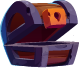

# Object Oriented Programming Case Study Exam - Resit

| Course | Object Oriented Programming |
|---|---|
| Code | CU75004V1 |
| Date | 26 January 2022 |
| Time | 09:00 |
| Duration | 180 minutes (+extra) |
| Submission | Submit on CodeGrade |

### Instructions
 - Read the requirements for the game starting on Page 2.
 - Download the starter .ZIP from Learn.
 - Unzip and load the directory into your Visual Studio Code (or your IDE of choice).
 - Run `npm install`.
 - Implement the basic requirements.
 - To compile, run `npm run build` (you can also enter watch mode using `npm run watch`).
 - Once you have completed the basic requirements, you can implement the advanced requirements.

### Allowed
 - Use of own laptop 
 - Use of books and/or own notes
 - Use of the Internet as a source of information / reference

### NOT Allowed
 - Use of the Internet as a means of communication (e-mail, Teams, Discord, posting to Stack Overflow, and similar)
 - Use of other means of communication like mobile phones
 - Use of headphones

### Submission
 - You must submit to the dedicated CodeGrade.
 - Submit ONLY your *.ts files.
 - You are allowed to hand in multiple times during the exam. After each hand-in you must wait 10 minutes before handing in again. This is allowed until the exam time is over.
 - CodeGrade will only test whether you code compiles successfully and the output from your ESLint. The rest of your exam will be  assessed manually.
 - The last code you handed in will be considered your final submission and will be graded.
 - The assessment rubric can be found on Page 4.

# The Wizard's Chest
> The wizard Mordak forgot to lock his magic chest and all the gems fell out. It's up to you to get them back and to prevent the evil Calvaria from getting to them.

Using your keyboard, you control a magic chest. As you catch gems, you should avoid the skulls and dynamite.

## Demonstration

You can play a [demonstration here](https://hz-hbo-ict.github.io/ts-wizards-chest/).

## Basic Requirements

 - A template class diagram is provided for you to start. Make good use of inheritance and polymorphism.

 - You may not alter the provided `GameLoop.ts`, `CanvasUtil.ts`, or `KeyListener.ts`.

 - The player is a chest () on the top of the screen and can move into either the left, middle, or right lane. You can control the chest with the keyboard.

 - Between 300ms and 600ms (milliseconds) either a new gem, skull or dynamite will appear on the bottom of the screen, in a random lane. A gem has 80% chance of appearing and a skull has 20% chance of appearing.

- There are 3 types of gems. Each gem will award the player with a different number of points, and has a chance of appearing:
    1. Red Gem : 100 points, 20% chance of appearing
    2. Green Gem : 50 points, 20% chance of appearing
    3. Blue Gem : 5 points, 60% chance of appearing

 - There are 3 skulls, each of which will lose the player a certain number of points:
    1. Red Skull : -100 points, 20% chance of appearing
    2. Green Skull : -50 points, 20% chance of appearing
    3. Blue Skull : -5 points, 60% chance of appearing

 - Gems and Skulls move from the bottom of the screen to the top in one of the three lanes at a speed of 0.2px per elapsed ms.

 - **Kaboom!** There is a 20% chance that a stick of dynamite () will appear. When the dynamite touches the chest, the player will lose all points (score set back to 0). 
 
 - The speed of the dynamite is 0.1px per elapsed ms, increasing by 0.005% each frame.

 - The player is said to have "caught" a gem, skull, or dynamite when the images collide.

 - The game is over and should stop when the player's score is less than 0, or 60 seconds have passed.

TIP: Here are are the x-values for the lanes:
 - Left Lane = 160
 - Middle Lane = 285
 - Right Lane = 410

### Class Diagram

*You may deviate from this given diagram, as long as you maintain good Object Oriented Programming principles.*

## Advanced Requirement
The magic chest can be locked and unlocked. If the chest is unlocked, it can catch gems and skulls and the player's score will be affected. Conversely, if the chest is locked, it cannot catch any gems or skulls; however dynamite is still dangerous! 

The chest can be locked and unlocked by keys that have a 10% chance of appearing. If the chest is locked, it will be unlocked; and if it is unlocked, it will be locked.

The chest will show whether it is unlocked () or locked ().

They key moves at 0.3px per elapsed ms.

You will have to extend the design of the classes to implement the advanced feature. You do not need to hand this updated class diagram in.

*TIP: Do not spend too much time on the advanced requirement if the main requirements are not implemented yet!*

# Marking Rubric

**Marking Threshold:** Code must compile without any errors from the TypeScript compiler. If the code does not compile, student will be awarded a 1. If, at the marker’s discretion, the compilation error can be fixed by spending less than 30 seconds, marking can continue.

| No | Criterion | Insufficient | Sufficient | Good | Excellent |
|:-:|---|---|---|---|---|
| 1 | Code quality & style | Style and quality deficient. ESLint errors are present. (0 pnts) | Types are  properly used for variables, attributes and methods. Some ESLint warnings (less than 5). (5 pnts) | Types are properly used. No ESLint warnings, except JSDocs warnings. (7 pnts) | Types are properly used. No ESLint problems. Good quality and style, including complete JSDocs. (10 pnts) |
| 2 | Inheritance & Composition | Most classes missing. (0 pnts) | Classes for functionality of game present. (10 pnts) | Most classes required for functional game are present with appropriate use of composition. Abstract classes are absent. (15 pnts) | Classes required for functional game (inherited and abstract) are present with good use of inheritance and composition. (20 pnts) |
| 3 | Abstraction & Encapsulation | Implementation of most class members (attributes and methods) are absent. (0 pnts) | Most required class members are implemented. (10 pnts) | Most class members appropriately communicate. (15 pnts) | Polymorphism appropriately used to reduce code duplication (20 pnts) |
| 4 | Functionality | Game has little to no functionality. (0 pnts) | Game is playable but not complete. Functionality is absent. (10 pnts) | Game is fundamentally complete, but not all features are present. (20 pnts) | Game functions exactly as per requirements. (30 pnts) |
| 5 | Advanced feature | Advanced feature not attempted. (0 pnts) | Traces of advanced feature present, but not functional. (5 pnts) | Advanced feature functional, but incomplete. (7 pnts) | Advanced feature functions exactly as per requirements. (10 pnts) |

## Credits
 - https://www.freepik.com/free-vector/game-icons-big-set-cartoon-skull-coin-star-xp-gold-cup-clock-chest-medal-money-sack-crown-lock-key-magnet-shield-witch-potion-gift-box-crystal-parchment-vector-ui-elements_24315604.htm
 - https://www.freepik.com/free-vector/treasure-chests-closed-open-with-colour-gems_28641118.htm
 - https://www.freepik.com/free-vector/magic-school-classroom-with-cauldron-night_16646800.htm