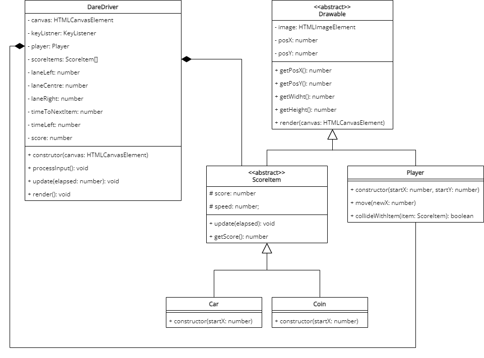

# Dare Driver
> Bro, how did I end up here?

Using your keyboard, you are racing against the traffic. Your goal is to avoid the cars, catch coins, and see if you can last one minute!

## Demonstration

You can play a [demonstration here](https://hz-hbo-ict.github.io/ts-dare-driver/).

## Technical Details

<!-- A template class diagram is given for your to start. Make good use of inheritance and polymorphism. -->

<!-- Your car () is at the bottom of the screen and can move into either the left, centre, or right lane. You can control the lanes with the keyboard. -->

<!-- Between 500 and 700ms a new car or coin will appear at the top in a random lane and move downward. A car has 65% chance of appearing and a coin 35% chance of appearing. -->

<!-- There are 5 types of coins, each worth a different amount of points and scarcity:
 - 5 points, 35% chance of appearing
 - 10 points, 25% chance of appearing
 - 25 points, 20% chance of appearing
 - 50 points, 15% chance of appearing
 - 100 points, 5% chance of appearing -->

<!-- There are 4 types of cars, each will lose the player a certain number of points:
 - 100 points, 5% chance of appearing
 - 50 points, 15% chance of appearing
 - 25 points, 20% chance of appearing
 - 10 points, 60% chance of appearing -->

<!-- The player is said to have "caught" the car or coin when the images collide. -->

<!-- Coins move at 0.2px per elapsed ms. -->

<!-- Cars move at 0.3px per elapsed ms. -->

<!-- TIP: Here are are the x-values for the lanes:
 - Left Lane = 165
 - Right Lane = 410
 - Centre Lane = 285 -->

<!-- The game is over in 60 seconds and should then stop. -->

## Class Diagram

# Bonus Feature

<!-- Add ice! If the player collides with the ice, their car will move random to one of the other lanes -->

## Credits
Coins: https://opengameart.org/content/coin-pack

Cars: https://opengameart.org/content/car