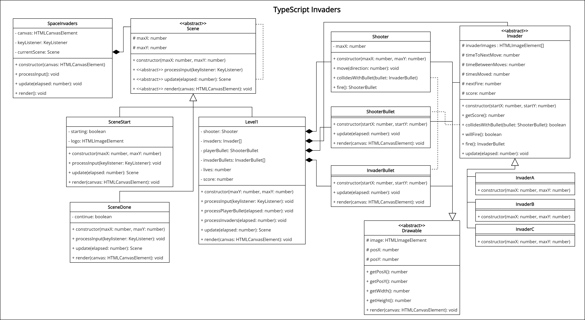

# TypeScript Invaders
> Originally released in 1978, Space Invaders is a classic arcade game that paved the way for many shooting titles. 

Using your keyboard, you control the shooter at the bottom of the screen. At the top, 55 invaders are making their way down to you, shooting as they go. Your aim is to destroy all the invaders before they get to you all the while avoiding getting shot yourself.

## Demonstration

You can play a [demonstration here](https://hz-hbo-ict.github.io/ts-invaders/).

## Technical Details

You must implement the game as per the class diagram given. Make good use of inheritance and polymorphism.

<!-- The game must start with a start screen. Once the user presses [S] on their keddddddddddwdwwwqdwdddddddddyboard, the game will start.  -->

<!-- At the start of the game, 5 rows of 11 invaders are spawned at the top of the screen:
 - 1 row 11 × Invader C 
 - 2 rows 11 × Invader B  
 - 2 rows 11 × Invader A   -->

<!-- The Shooter () is spawned at the bottom of the screen. It can move left and right only, but is constrained by the limits of the screen. -->

<!-- The player shoots by pressing the [space] or [F] button on their keyboard. The player's bullets original from the top-center of the shooter. The player's bullets are yellow rectangles W: 5px × H: 14px -->

<!-- The player can only have ONE active bullet at a time. (that is, the player cannot shoot until their previous bullet as either hit and destroyed an invader, or it leaves the screen at the top) -->

<!-- If the player destroys an invader, they will get points:
 - Invader A: 10 points
 - Invader B: 20 points
 - Invader C: 30 points -->

<!-- All invaders will shoot. Their bullets originate from the bottom-center of the invader. Each one will shoot once every 7 to 10 seconds. The invaders' bullets are white rectangles W: 5px × H: 9px -->

<!-- The player has 3 lives. The player loses a life when an invader's bullet hits them. -->

<!-- Every time the player shoots, they will lose 1 point. The minimum score is 0. -->

<!-- The invaders must move across the screen. They should move, in unison, every 500ms. Their movement repeats as follows:
 1. Move right 12 times
 2. Move down
 3. Move left 12 times
 4. Move down -->

<!-- When moving, the invaders must alternate between their two frames:  <->  -->

<!-- The game is won when all the invaders have be destroyed. -->

<!-- The game is lost when the player loses all their lives. -->

### Bonus Details

<!-- Make the invaders move faster as time progresses. But not too fast to look silly. -->

Implement the mothership () that will appear from at random times and fly horizontally across the screen from right to left. The mothership also shoots, but at smaller intervals. The mothership is worth 500 points when destroyed.

## Class Diagram

## Credits
Origin Design - Tomohiro Nishikado