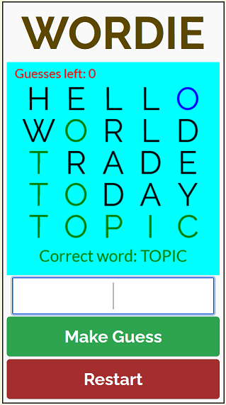
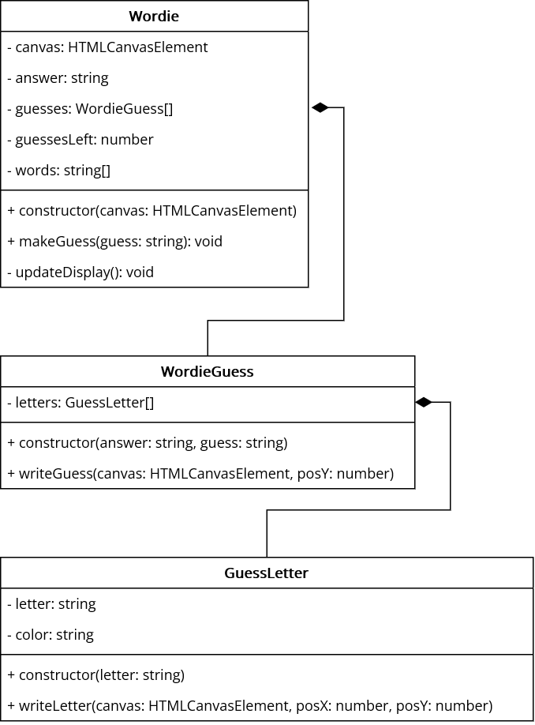

# Wordie!

A clone of the very (un)popular Wordle game.

The game starts by selecting a random word from a list of words. The player then has 5 attempts to guess the correct word. After every guess, the game shows which letter(s) are in the correct position as well as which letter(s) are correct, but not in the correct location.

A playable version can be found [here](https://hz-hbo-ict.github.io/ts-wordie/)

## Class Diagram

Before looking at the class diagram below, attempt to analyse the the game and its components first.

